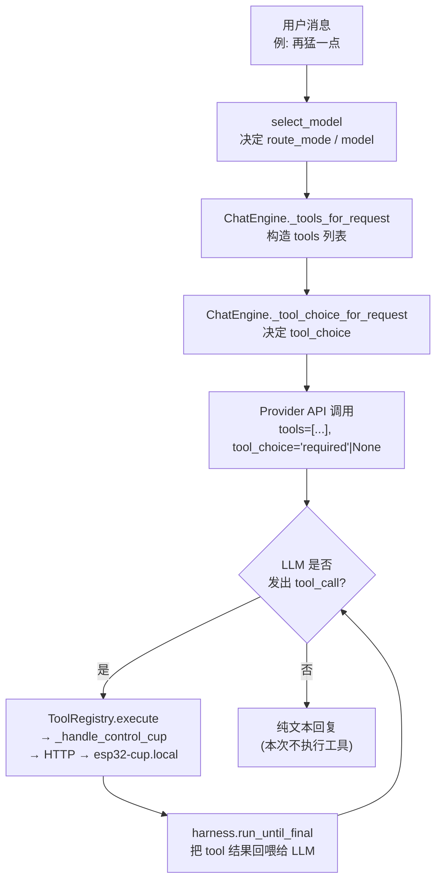
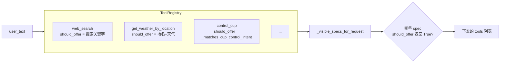
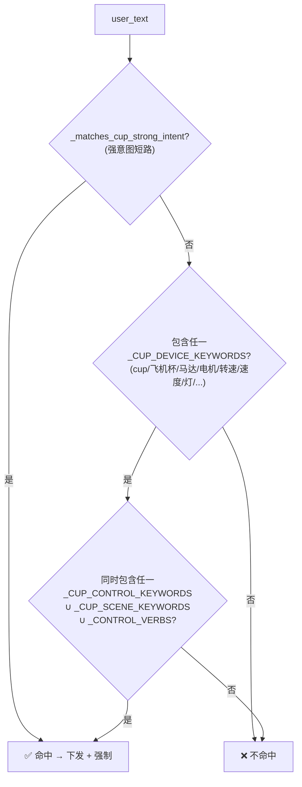
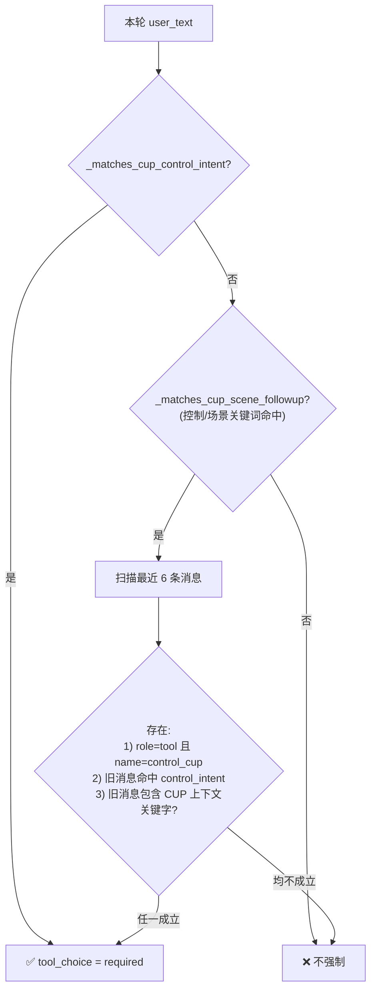
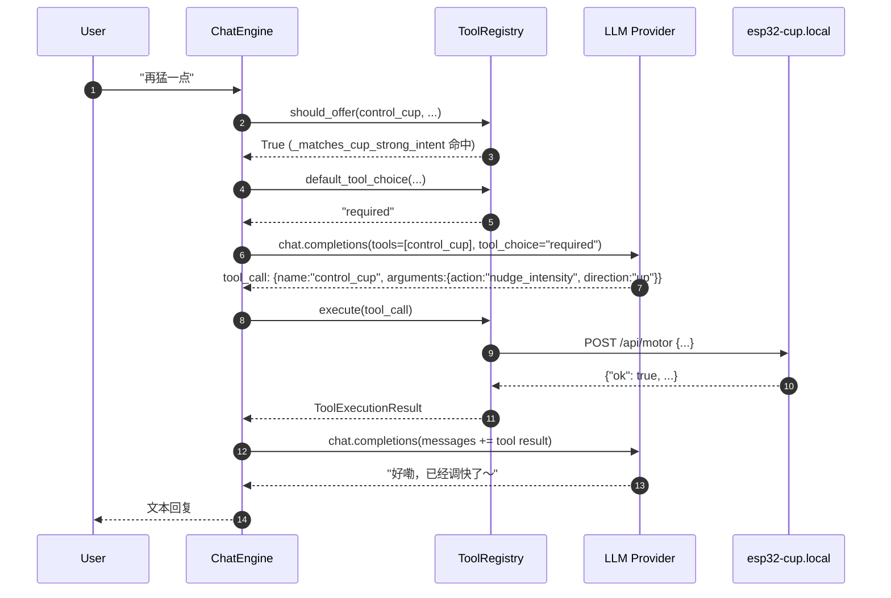
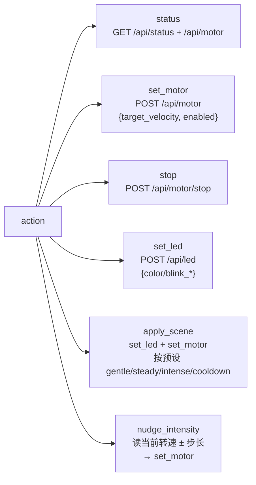
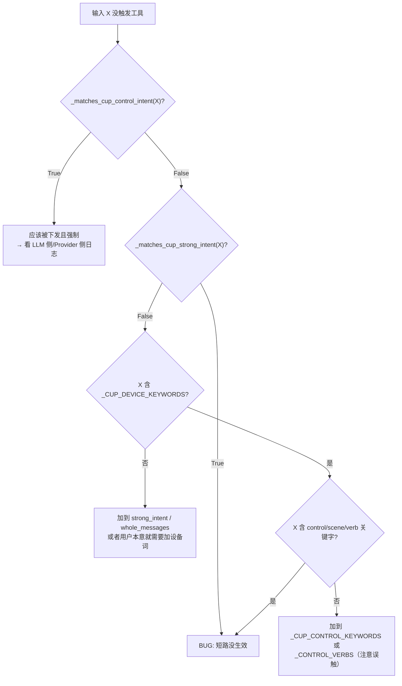

# CUP 工具调用触发流程详解

本文档解释一条用户消息从进入 Whesper 到最终调用 `control_cup`（向 ESP32 硬件发 HTTP 请求）之间，整条链路会经过哪些判断、哪些门槛决定了"是否触发工具调用"。

> 相关源码：
> - `src/whesper/tools.py` — 关键词、意图匹配、`ToolRegistry`
> - `src/whesper/chat.py` — `ChatEngine` / `_tool_choice_for_request` / followup 逻辑
> - `src/whesper/agent_harness.py` — 多轮工具循环

---

## 1. 宏观链路



触发工具调用需要两个条件**同时成立**：

1. **工具必须被下发**：`tools` 列表里出现 `control_cup`
2. **LLM 必须选择调用它**：要么自愿调用，要么被 `tool_choice="required"` 强制

所以整个调试问题可以拆成两个子问题：*"工具有没有被下发？"* 和 *"有没有强制调用？"*

---

## 2. 两个关键门：`should_offer` 与 `default_tool_choice`

每个 `ToolSpec` 都带一个 `should_offer(user_text, route_mode)` 回调，决定该工具是否出现在下发给 LLM 的 `tools` 列表中。



- **`should_offer` 返回 True** → 工具被放进 `tools` 参数 → LLM "知道有这个工具"
- **`default_tool_choice` 返回 `\"required\"`** → LLM *必须*从 `tools` 里挑一个调用，不能纯文本回答

```python
# src/whesper/tools.py
def default_tool_choice(self, *, user_text, route_mode) -> str | None:
    if route_mode == "search":
        return "required"
    for spec in self.specs:
        if not spec.execution_meta.visible_to_model: continue
        if not spec.execution_meta.side_effectful: continue   # 只有 side-effect 工具才强制
        if spec.should_offer and spec.should_offer(user_text, route_mode):
            return "required"                                  # 关键：命中即强制
    return None
```

所以对于 **`control_cup`（side_effectful=True）**：
`should_offer` 和 `default_tool_choice` 共用同一个判据 `_matches_cup_control_intent`。一旦命中，**又下发又强制**。

---

## 3. `_matches_cup_control_intent` 内部判据

这是整套流程的核心门槛。一个用户输入要匹配为 CUP 控制意图，必须走过下面任一路径：



### 3.1 强意图短路（`_matches_cup_strong_intent`）

某些短语在这个 app 的语境里**单独出现就足够明确**，不需要再出现"灯/杯/电机"这种设备词：

- 节奏/强度口语：`刺激一点`、`猛一点`、`温柔一点`、`舒缓点吧`、`再轻一点`…
- 速度副词/动词：`加快`、`放慢`、`降速`、`提速`、`全速`、`最大速度`…
- 力度：`用力一点`、`大力点`、`松一点`…
- 停机：`停下`、`停止`、`停转`、`停机`、`暂停`…

同时一组"**整句精确匹配**"单字/短词防误触：

```python
_CUP_STRONG_INTENT_WHOLE_MESSAGES = ("停", "最快", "最慢", "最大", "最小", "最低", "最强", "最弱")
```

- `"停"` 单发 → 命中
- `"停车"` / `"停了一会儿"` → **不命中**（子串 `"停" in "停车"` 为 True 但 whole-message 判据用 `==`）
- `"最快"` 单发 → 命中
- `"你跑得最快"` → **不命中**

### 3.2 设备词 + 控制词（原有路径）

```python
_CUP_DEVICE_KEYWORDS   # cup, 飞机杯, 马达, 电机, motor, 转速, 速度, 震动, 振动, 灯, led, 灯光, 颜色, 灯色
_CUP_CONTROL_KEYWORDS  # status/状态/怎么样/多少/当前/参数/启动/停止/快一点/慢一点/降速/提速/调到/降到/...
_CUP_SCENE_KEYWORDS    # gentle/intense/轻柔/温柔/舒缓/刺激/猛烈/...
_CONTROL_VERBS         # set/change/调/调到/换/改/开/关/降/升/提/加/减/...
```

"**设备词 ∧ (控制词 ∨ 场景词 ∨ 动词)**" 两个集合都命中才算意图。  
这样 `"把转速调到80"`（`转速`+`调到`）命中，`"我降到那里"`（只有`降`，无设备）不命中。

---

## 4. Followup：基于会话上下文的"宽松模式"

第一条消息如果不够明确，`should_offer` 不会下发工具。但如果之前的几轮已经在聊 CUP，我们希望用户接着说 `"调到80"` 也能触发。

`ChatEngine._should_require_cup_followup_tool_choice` 负责这块：



**关键点**：`_hardware_followup_tools_for_request`（`chat.py:813`）只有在本轮 `should_offer` 都没匹配到任何工具时才会启用。它会**补发 `control_cup`**，并由 `_tool_choice_for_request` 把 `tool_choice` 设为 `"required"`。

### 会话上下文关键字
```python
context_keywords = (
    "cup", "飞机杯", "motor", "转速", "震动", "振动", "马达", "电机",
    "灯", "led", "灯光", "颜色", "灯色",
)
```

---

## 5. LLM 调用、工具执行与多轮循环



- `run_until_final`（`agent_harness.py`）允许**多轮**工具调用，LLM 可以先 `status` 再 `nudge_intensity`
- `control_cup` 的 `execution_meta.side_effectful=True`，这是强制 tool_choice 与"需要明确用户意图"这条 prompt 约束共同依赖的标志

---

## 6. `control_cup` 工具本身能做什么

一次 `control_cup` 调用的 `action` 字段决定走向：



- 所有 HTTP 都走 `cup_settings.base_url`（默认 `http://esp32-cup.local`）
- `nudge_intensity` 会先 `GET /api/motor` 拿当前值，再写回，步长受 `_CUP_MAX_TARGET_VELOCITY=140.0` 约束

---

## 7. 常见"没触发"的排查顺序

给一条没触发的输入 `X`，按以下顺序查：



可以直接在 shell 里跑：

```bash
PYTHONPATH=src python3 -c "
from whesper.tools import (
    _matches_cup_control_intent,
    _matches_cup_scene_followup,
    _matches_cup_strong_intent,
)
for msg in ['你的句子1', '你的句子2']:
    print(msg,
          'strong=', _matches_cup_strong_intent(msg),
          'intent=', _matches_cup_control_intent(msg),
          'fup=',    _matches_cup_scene_followup(msg))
"
```

---

## 8. 调整时的取舍清单

| 目标 | 改哪个集合 | 风险 |
|---|---|---|
| 让某个**明确设备 + 动作**的句子更容易命中 | `_CUP_DEVICE_KEYWORDS` 或 `_CUP_CONTROL_KEYWORDS` | 低（需两者共存） |
| 让某个**口语短语独立出现**就命中 | `_CUP_STRONG_INTENT_PHRASES` | 中（substring 匹配，可能误触长句） |
| 让一个**单字/短词**整句出现才命中 | `_CUP_STRONG_INTENT_WHOLE_MESSAGES` | 低（等号匹配 + 去标点） |
| 放宽**上下文中的后续追问** | `_CUP_SCENE_KEYWORDS` 或 `_CUP_CONTROL_KEYWORDS`（参与 followup 判据） | 中（依赖最近 6 条有 CUP 痕迹） |
| 让 LLM 更爱/更不爱调 tool | 改 `control_cup` 的 `description` / `usage_guidance` / `examples` | 高（影响模型行为，难回归） |

---

## 9. TL;DR

1. **关键词匹配→是否下发工具**，再**强制/非强制**两种 `tool_choice`。
2. CUP 的匹配 = `强意图短路` **或** `设备词 ∧ 控制/场景/动词`。
3. 若首轮不匹配，`_hardware_followup_tools_for_request` 在**最近 6 条消息有 CUP 痕迹**时会兜底补发并强制。
4. 最终是否调用还取决于 LLM 本身；强制 `required` 模式下 LLM 必须从给定 tools 里挑一个。
5. 排查顺序：**Strong → Device∧Control → Followup → LLM 行为**。
