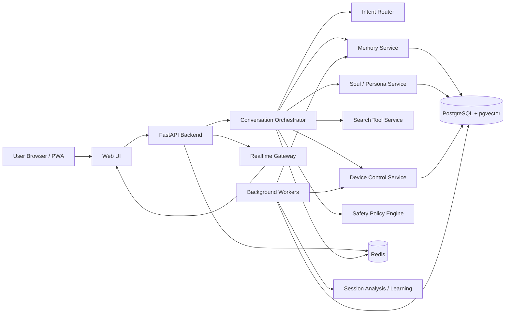
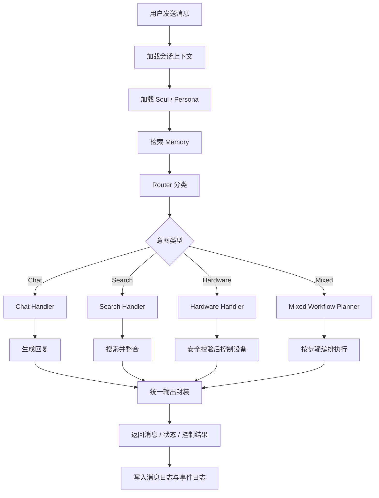
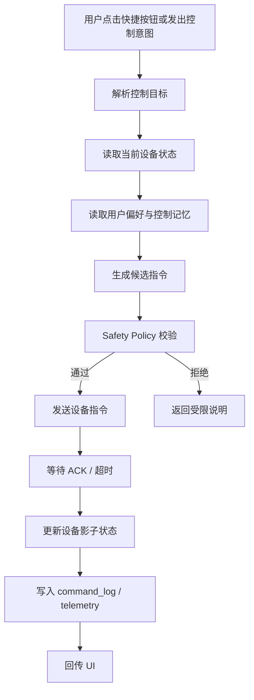
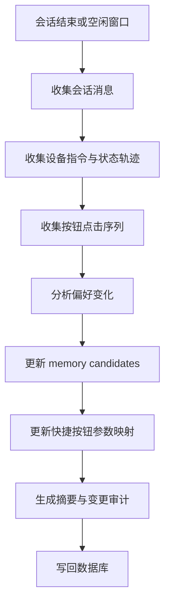
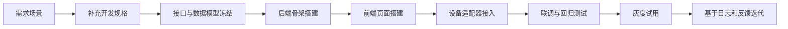
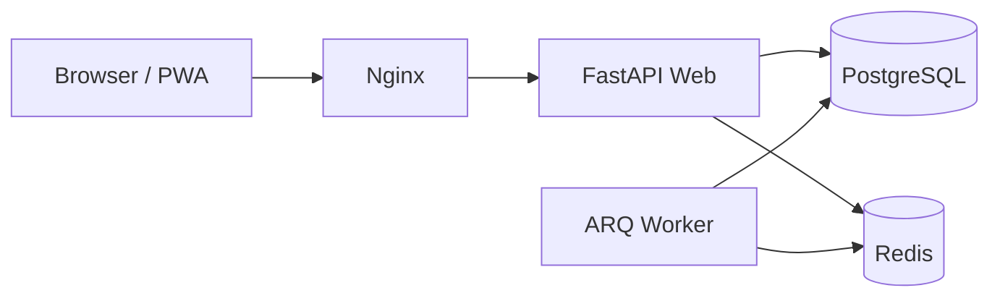

# Whesper MVP 开发规格说明

## 1. 文档目标

本文档将当前的产品想法整理成可直接进入研发的 MVP 方案，目标是：

- 明确 MVP 范围，避免一开始做成过重的“全能 Agent”
- 定义模块边界、数据流、接口、任务流和工程拆分方式
- 在尽量使用 Python 的前提下，给出可执行的技术选型
- 提前暴露高风险假设，尤其是 Web App 与硬件控制的可行性问题

本文档基于你给出的场景描述，以及 `multi_mode_agent_router` 流程图进行展开。

## 2. 产品定位

Whesper 是一个面向私密陪伴与设备联动体验的 Web Agent 产品。MVP 阶段聚焦三件事：

1. 让用户可以像和聊天软件好友一样，与一个具有稳定人格的虚拟 Agent 长期文字对话。
2. 让 Agent 在设备使用场景中具备“可见状态 + 快捷调节 + 基于习惯学习”的能力。
3. 让系统能够持续积累用户偏好、设备使用习惯和会话上下文，并在空闲时更新 memory。

## 3. MVP 范围

### 3.1 In Scope

- Web App 聊天界面
- Persona / Soul 配置
- 长短期 memory 管理
- Router 意图分类
- Chat / Search / Hardware 三条主路径
- 设备状态展示
- 快捷按钮控制，例如“快一点”“慢一点”
- 快捷按钮参数自适应学习
- 使用期数据打包与离线分析
- 基础权限、安全约束、审计日志

### 3.2 Out of Scope

- 语音、视频、多模态输入
- 多设备品牌同时兼容
- 强实时复杂控制算法
- 真正意义上的强化学习
- 复杂社交系统
- App Store 原生应用

## 4. 关键假设

### 4.1 高风险假设

MVP 默认假设硬件侧存在一种 Web 可接入的控制方式，至少满足以下之一：

- 设备提供本地 HTTP / WebSocket / MQTT / 局域网网关接口
- 设备提供云端 API，可由后端代表用户控制
- 设备虽然是 BLE，但存在浏览器可用的桥接方式

如果设备只能通过原生 BLE 控制，那么“仅 Web App”会受到明显限制：

- iOS Safari 对 Web Bluetooth 支持非常有限
- 移动端纯网页难以稳定直连 BLE 设备
- 这会直接影响 MVP 的架构和交付平台

因此，`硬件通信协议` 是当前最需要你确认的技术前提。

### 4.2 其他默认假设

- 单用户单账号为主，不考虑多人共享设备
- 初期只支持一种设备协议，通过 adapter 预留扩展
- 搜索工具主要用于解释、建议、信息增强，不直接用于高风险判断
- memory 以“可解释规则 + 向量检索”混合方案实现，而不是黑盒长期学习

## 5. 用户故事

### 5.1 日常陪伴

- 作为用户，我希望每天都能和一个稳定人格的 Agent 聊天
- 作为用户，我希望 Agent 会记住我过去提过的人、偏好、事件和说话风格
- 作为用户，我希望 Agent 会主动延续上下文，而不是每次都像新会话

### 5.2 设备使用

- 作为用户，我希望设备启动时自动读取我的偏好配置
- 作为用户，我希望聊天界面里可以一键“快一点”“慢一点”
- 作为用户，我希望这些快捷按钮越来越懂我，而不是永远固定加减
- 作为用户，我希望 Agent 能在对话中结合我的状态、历史和设备数据做温和调整

### 5.3 后台学习

- 作为系统，我需要记录消息、指令、设备状态、按钮点击和会话结果
- 作为系统，我需要在空闲时更新 memory，并优化快捷按钮映射

## 6. 总体架构

### 6.1 架构原则

- Python-first：后端、任务系统、Agent 编排尽量全部使用 Python
- Web-first：MVP 仅提供 Web App，优先兼容移动浏览器与桌面浏览器
- Safety-first：所有硬件控制都先过约束层，再发实际指令
- Explicit Workflow：MVP 采用显式工作流，不上过重的自治 Agent 框架
- Single Source of Truth：memory、设备状态、命令日志、学习结果统一沉淀到服务端

### 6.2 系统组件图



### 6.3 推荐技术栈

### 后端

- Python 3.12
- FastAPI
- Pydantic v2
- SQLAlchemy 2.0 + Alembic
- PostgreSQL 16
- pgvector
- Redis
- ARQ 作为异步任务队列

### 前端

- FastAPI + Jinja2 模板
- HTMX 处理聊天提交、局部刷新
- Alpine.js 处理少量前端状态
- Tailwind CSS
- PWA Manifest + Service Worker

说明：

- 这样可以把前后端复杂度压低，主体逻辑仍然在 Python
- 如果后续需要更强交互，再把前端替换成 React/Next.js

### LLM 与工具层

- OpenAI 兼容模型接口，封装为 `LLMProvider`
- Pydantic 结构化输出，用于 Router 和命令规划
- 搜索工具采用 provider adapter，例如 Tavily / Exa / 自建 SearXNG

### 监控与工程化

- Sentry：异常监控
- Structlog / Loguru：结构化日志
- Pytest：测试
- Ruff + Black：代码质量
- GitHub Actions：CI

## 7. 运行时主流程

### 7.1 消息处理主流程



### 7.2 硬件控制流程



### 7.3 离线学习流程



## 8. 核心模块设计

### 8.1 Web UI

职责：

- 展示聊天流
- 展示设备连接状态、当前工作状态
- 提供快捷控制按钮
- 展示 Agent 回复、搜索摘要、控制结果

MVP 页面建议：

- `/login`
- `/chat`
- `/settings/soul`
- `/settings/device`
- `/session/:id`

UI 结构建议：

- 左侧或顶部：会话列表
- 主区域：聊天消息流
- 右侧或底部浮层：设备状态面板
- 输入框上方：快捷按钮条

### 8.2 Conversation Orchestrator

职责：

- 统一承接用户输入
- 组装上下文
- 调用 Router
- 调用对应 handler
- 汇总最终输出

建议实现：

- 采用明确的 Python service，不直接把控制权完全交给 Agent framework
- 每次请求都输出标准 `ExecutionTrace`

核心对象建议：

- `ConversationContext`
- `RouteDecision`
- `ExecutionPlan`
- `ActionResult`

### 8.3 Router

职责：

- 对输入进行轻量意图分类
- 判断是否需要单路径还是混合路径
- 产出结构化路由结果

建议分类：

- `chat`
- `search`
- `hardware_control`
- `status_query`
- `memory_update_hint`
- `mixed`

建议策略：

- 第一层：规则优先，例如明确的按钮、命令词、设备查询词
- 第二层：轻量 LLM 分类
- 第三层：置信度低时走保守策略，不自动控制硬件

示例输出：

```json
{
  "route": "mixed",
  "subtasks": ["chat", "search", "hardware_control"],
  "confidence": 0.86,
  "requires_safety_check": true
}
```

### 8.4 Soul / Persona Service

职责：

- 管理虚拟角色设定
- 管理回复语气、边界、主动话题风格
- 为每次推理注入系统提示

MVP 建议：

- Persona 使用结构化字段，不直接只存一大段 prompt
- 可配置字段包括：
  - 名称
  - 语气风格
  - 主动性强弱
  - 话题偏好
  - 禁忌边界
  - 对设备互动的风格偏好

### 8.5 Memory Service

建议将 memory 分为 5 类：

- `profile_memory`：稳定用户画像，例如作息、偏好、关系状态
- `episodic_memory`：近期事件，例如“昨天加班”“最近睡不好”
- `conversation_memory`：对话摘要和上下文
- `preference_memory`：回复风格、搜索偏好、内容偏好
- `device_memory`：设备默认参数、快捷按钮参数、会话习惯

实现建议：

- 结构化 memory 存 PostgreSQL
- 语义检索使用 pgvector
- 每条 memory 需要 `source`, `confidence`, `last_confirmed_at`, `expires_at`

写入原则：

- 实时只写低风险事件和原始日志
- 总结性 memory 尽量由后台任务写入
- 对“用户长期偏好”的改写要保留版本历史

### 8.6 Search Service

职责：

- 接收查询任务
- 改写查询
- 搜索
- 摘要整合
- 返回可供回复使用的证据片段

MVP 原则：

- Search 只提供信息增强，不绕过主回复层直接输出
- Search 结果必须标记来源
- 对健康、心理、医学类内容要加免责声明与保守回答策略

### 8.7 Device Control Service

职责：

- 管理设备连接
- 查询设备状态
- 发送控制命令
- 维护设备影子状态
- 记录 ACK、失败、超时和重试

设计建议：

- 使用 `DeviceAdapter` 抽象不同协议
- 所有外部硬件协议都走 adapter，不允许业务代码直接调 SDK

接口示意：

```python
class DeviceAdapter(Protocol):
    async def connect(self, user_id: str, device_id: str) -> DeviceState: ...
    async def get_state(self, device_id: str) -> DeviceState: ...
    async def send_command(self, device_id: str, command: DeviceCommand) -> CommandAck: ...
```

### 8.8 Safety Policy Engine

职责：

- 对所有控制命令做约束校验
- 防止过大步进、频繁指令、非法组合、状态不一致

MVP 规则建议：

- 限制最大强度、最大增量、最小控制间隔
- 状态未知时只允许查询，不允许强控
- 混合意图中，聊天内容不能直接越过规则层触发高风险控制
- 支持用户一键停止

### 8.9 Learning Engine

职责：

- 学习“快一点 / 慢一点”等语义按钮实际对应的参数
- 识别会话中常见偏好模式
- 更新 device memory

MVP 不建议直接上强化学习，先用可解释的启发式学习：

- 如果用户在 60 秒内连续两次点击“快一点”，说明当前步进偏小
- 如果用户点击“快一点”后很快又点击“慢一点”，说明步进偏大
- 根据设备档位、会话阶段、历史偏好分层维护 delta

示例：

- 初始 `快一点 = +5%`
- 连续多个 session 里都出现“快一点 -> 还要再快一点”
- 将该用户在相似场景下的 `快一点` 更新为 `+7%` 或 `+8%`

建议输出结构：

- `semantic_action = increase_speed`
- `context_bucket = session_mid_phase`
- `recommended_delta = 0.08`
- `confidence = 0.72`

## 9. 数据模型建议

### 9.1 核心表

- `users`
- `souls`
- `user_soul_profiles`
- `conversations`
- `messages`
- `memory_items`
- `memory_change_log`
- `devices`
- `device_profiles`
- `device_sessions`
- `device_state_snapshots`
- `device_commands`
- `quick_action_mappings`
- `quick_action_feedback_events`
- `analysis_jobs`
- `search_queries`
- `search_results_cache`
- `audit_logs`

### 9.2 关键字段建议

### `messages`

- `id`
- `conversation_id`
- `role`
- `content`
- `route_decision`
- `tool_calls`
- `created_at`

### `memory_items`

- `id`
- `user_id`
- `memory_type`
- `title`
- `content`
- `embedding`
- `confidence`
- `source`
- `status`
- `last_confirmed_at`
- `expires_at`
- `version`

### `device_commands`

- `id`
- `device_session_id`
- `command_type`
- `payload`
- `planned_by`
- `safety_result`
- `ack_status`
- `latency_ms`
- `created_at`

### `quick_action_mappings`

- `id`
- `user_id`
- `device_profile_id`
- `action_key`
- `context_bucket`
- `delta_value`
- `confidence`
- `updated_by`
- `updated_at`

## 10. 接口设计建议

### 10.1 HTTP API

### 会话

- `POST /api/v1/chat/send`
- `GET /api/v1/conversations`
- `GET /api/v1/conversations/{id}`

### Soul / Persona

- `GET /api/v1/souls`
- `POST /api/v1/user/soul-profile`
- `PATCH /api/v1/user/soul-profile`

### Memory

- `GET /api/v1/memory`
- `PATCH /api/v1/memory/{id}`
- `POST /api/v1/memory/rebuild`

### Device

- `POST /api/v1/devices/connect`
- `GET /api/v1/devices/{id}/state`
- `POST /api/v1/devices/{id}/command`
- `POST /api/v1/devices/{id}/quick-action`
- `POST /api/v1/devices/{id}/stop`

### Analysis

- `POST /api/v1/analysis/run-latest`
- `GET /api/v1/analysis/jobs/{id}`

### 10.2 WebSocket 事件

建议单独使用 `/ws/session/{conversation_id}`：

- `message.delta`
- `message.final`
- `device.state.updated`
- `device.command.ack`
- `analysis.summary.ready`
- `session.warning`

## 11. 混合意图执行策略

对于类似：

> “我现在有点提不起性趣”

MVP 建议不要让 Router 直接给出一个终局回复，而是拆成规划步骤：

1. 判断是否需要情绪性陪伴回复
2. 判断是否需要调用搜索或知识库
3. 判断是否适合建议轻微设备调整
4. 最后统一生成一个自然语言回复

对应执行计划示意：

```json
{
  "steps": [
    {"type": "chat_response"},
    {"type": "search", "query": "low libido causes and general suggestions"},
    {"type": "hardware_adjust", "mode": "soft", "requires_confirmation": false}
  ]
}
```

原则：

- 搜索和控制都不是默认必做项
- 任何控制动作必须可回溯
- 当模型不确定时，优先只聊天、不控制

## 12. 工程目录建议

```text
whesper/
├── app/
│   ├── api/
│   ├── core/
│   ├── db/
│   ├── domain/
│   ├── services/
│   │   ├── orchestrator/
│   │   ├── router/
│   │   ├── memory/
│   │   ├── souls/
│   │   ├── search/
│   │   ├── device/
│   │   ├── safety/
│   │   └── learning/
│   ├── tasks/
│   ├── templates/
│   ├── static/
│   └── main.py
├── tests/
│   ├── unit/
│   ├── integration/
│   └── e2e/
├── docs/
├── alembic/
├── pyproject.toml
└── README.md
```

## 13. 软件工程流程建议

### 13.1 开发流程



### 13.2 建议迭代顺序

### Sprint 1: 基础骨架

- FastAPI 项目初始化
- 用户体系
- 聊天页面
- conversations / messages 表
- 基础 LLM 回复

### Sprint 2: Soul + Memory

- Soul 配置页
- Memory 数据结构
- memory 检索与写入
- 会话摘要任务

### Sprint 3: Router + Search

- Router 分类
- Search adapter
- mixed workflow 基础版

### Sprint 4: Device + Safety

- Device adapter
- 设备状态展示
- 快捷按钮控制
- Safety Policy

### Sprint 5: Learning + Analysis

- quick action 学习模块
- 离线会话分析
- memory consolidation

### 13.3 Git 与分支建议

- 主分支：`main`
- 功能分支：`feat/*`
- 修复分支：`fix/*`
- 文档分支：`docs/*`

提交规范建议：

- `feat(router): add mixed intent classifier`
- `feat(device): add safety constrained quick action`
- `fix(memory): avoid duplicate episodic items`

## 14. 测试策略

### 14.1 单元测试

- Router 分类输出
- Safety Policy 规则判断
- Learning delta 更新逻辑
- Memory 检索与去重

### 14.2 集成测试

- `chat/send` 到最终回复链路
- Search handler 工具调用链路
- Device command -> ack -> state snapshot
- Analysis job -> memory update

### 14.3 端到端测试

- 日常聊天场景
- 设备连接 + 控制场景
- 快捷按钮学习场景
- 混合意图场景

### 14.4 必做 Mock

- LLM provider mock
- Search provider mock
- Device adapter mock

这样可以保证 MVP 即使没有真实设备，也能先完成大部分联调。

## 15. 隐私、安全与合规

Whesper 涉及敏感数据，MVP 也必须先做基础防护：

- 用户年龄门槛与同意确认
- 敏感日志分级存储
- 设备指令审计日志
- PII 脱敏
- at-rest 加密
- 最小权限访问控制
- 删除数据与导出数据的能力预留

建议：

- 用户原始对话和分析摘要分表存储
- telemetry 和 message 数据可分级保留
- 后台分析任务不要默认把全部原文喂给第三方模型

## 16. 部署建议

### MVP 部署形态

- 1 个 FastAPI Web 实例
- 1 个 Worker 实例
- 1 个 PostgreSQL
- 1 个 Redis



### 环境划分

- `local`
- `staging`
- `production`

### 配置项建议

- `LLM_API_KEY`
- `LLM_BASE_URL`
- `DATABASE_URL`
- `REDIS_URL`
- `SEARCH_PROVIDER`
- `DEVICE_PROVIDER`
- `ENCRYPTION_KEY`

## 17. MVP 成功标准

如果以下目标可以稳定达到，就说明 MVP 基本成立：

- 用户能稳定完成持续文本对话
- Soul 风格可以显著影响回复
- Agent 能记住并调用关键 memory
- Router 能把大多数输入正确分到 chat / search / hardware / mixed
- 用户能看到设备状态并完成快捷调节
- “快一点 / 慢一点” 参数能在多次 session 后产生可观察优化
- 会话结束后能形成摘要并更新 memory

## 18. 当前最需要确认的问题

这些问题会直接影响第一版工程方案，建议你尽快确认：

1. 硬件控制协议是什么？
   - BLE、Wi-Fi、本地网关、MQTT、还是厂商云 API？

2. Web App 主要目标平台是什么？
   - iPhone Safari、Android Chrome、桌面 Chrome，还是以桌面为先？

3. 搜索能力更像哪种？
   - 通用网页搜索、垂直知识库、还是你自己的内容库？

4. Soul 是否允许用户自己编辑，还是只从预设角色中选择？

5. memory 是否需要“用户可见 / 可修改 / 可删除”？

6. 设备是否会有实时传感器回传？
   - 如果有，频率大概是多少？

## 19. 推荐的 MVP 实施结论

基于当前信息，推荐你采用以下路线：

- Web 端做成 PWA，而不是重型前后端分离
- 后端采用 FastAPI + PostgreSQL + Redis + ARQ
- Agent 采用“显式编排 + 结构化输出”，不要上过重自治框架
- Memory 采用“结构化表 + pgvector 检索”的混合方案
- 快捷按钮学习先用启发式算法，不做复杂 RL
- Device 层通过 adapter 隔离，优先只接一种协议
- 把 Safety Policy 作为独立模块，不嵌进 prompt 里赌模型稳定性

如果硬件协议确认可行，这套方案足够支撑一个可以真实测试用户体验的 MVP。
